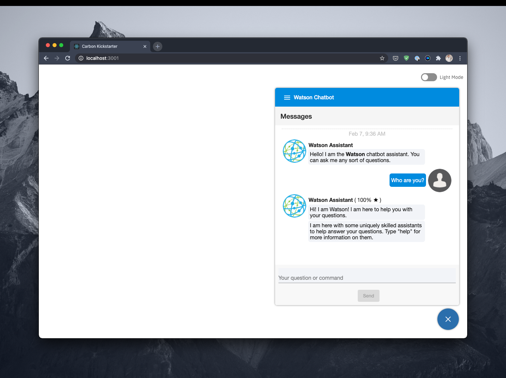

# Watson Chatbot



❗The project for the Watson-based Chatbot REST API and user interface.

## 🏁 Getting Started

⚠️ Prior to installing and configuring the tooling on our system, let's first set-up our GitHub SSH keys for IBM.

- Please follow the guide found [here](https://docs.github.com/en/enterprise/2.21/user/github/authenticating-to-github/adding-a-new-ssh-key-to-your-github-account) to configure your GitHub account to use your new (or existing) SSH key.

### Configuration

Please edit [server/config.js](server/config.js) for local development.

### Set Up

**Clone** the [chatbot](https://github.com/nicholasadamou/watson-chatbot) repository:

```bash
git clone git@github.com:nicholasadamou/watson-chatbot.git
```

**Create .env** that contains some of the following _secrets_.

```text
CHAT_KEY=<The key provided to you for the Watson Assistant instance you set up>
WATSON_ASSISTANT_ID=<The ID related to the Watson Assistant assistant within the Watson instance>
JWT_KEY=<The JWT key used in part of JWT token verification>
JWT_SECRET=<The JWT secret used in part of JWT token verification>
ENV=<Which "env" to load configuration for [dev, test, prod]>
DEBUG=<If enabled, adds additional REST APIs for debugging for development purposes (e.g. get the environment details). Should not be enabled in Prod cause it can include secret/credential details>
```

### Using `node`

#### Using `dev` npm run script

The below script will first, install node dependencies for [angular-app](angular-app) and [server](server), then build the [angular-app](angular-app) and copy it over to [server/ui](server/ui). Finally, it will execute `nodemon` against [server/server.js](server/server.js).

```bash
npm run dev
```

In order to access the front-end UI using this script, you need to visit: [http://localhost:6001/chatbot](http://localhost:6001/chatbot).

#### Running client & server separately

**STEP 1**: Install Node dependencies:

```bash
npm install
```

**STEP 2**: Install Angular and [nodemon](https://nodemon.io) if not already installed:

```bash
npm install -g @angular/cli nodemon
```

**STEP 3**: Execute [nodemon](https://nodemon.io):

```bash
nodemon server/server.js
```

This will setup the server and tells the server to listen on port `6001` @ the URL: `localhost:6001`.

**STEP 4**: In a different terminal instance from the `chatbot` directory execute:

```bash
cd angular-app && ng serve
```

To access the front-end UI after executing `ng serve` in a seperate terminal instance, you need to visit: [http://localhost:4200/chatbot](http://localhost:4200/chatbot).

### Using `docker`

**STEP 1**: Use `make` to build the docker image.

```bash
make all
```

**Step 2**: Start the docker container.

```bash
docker-compose up
```

**tldr;**

Execute the following:

```bash
npm run docker
```

This command will execute `make` and `docker-compose` as well as `npm run clean`.

In order to access the front-end UI using this script, you need to visit: [http://localhost:6001/chatbot](http://localhost:6001/chatbot).

## 🔐 How User Authentication Works

This application assumes that the authentication flow that the parent web application (e.g. [test/](test/)) is using is **SSO** with _JWT_.

The authentication flow starts when the user hits the chatbot itself. If the user is not currently authenticated, then it will make a request to `/chatbot/auth/login`. The chatbot back-end server obtains the encoded JWT token from the domain cookie which was generated during the SSO authentication flow from the parent web application. It then reads, decodes, and verifies that JWT Token and if successful, the chatbot back-end server ([server/server.js](server/server.js)) will send back a JSON object back to the client containing the user that was authenticated and whether or not the authentication was successful. The front-end will then store that user in local storage and make a request for the user's avatar using the email address contained within the user object which will then be displayed on the front-end UI.

**Roles**:

**0** : No-role (no-access e.g. Anonymous)

- Occurs if JWT token is not verified, is invalid, or does not exist or application is run in DEV mode (e.g. `process.env.ENV === DEV`).

**X** : Role determined by user login

- Occurs if JWT token is verified, not invalid, and does exist and application is not running in DEV mode.

**Authentication States**:

1. _Anonymous_

- Client uses no-role, limited access.

1. _Authenticated_

- Client uses role determined by the verified and decoded JWT Token obtained from the domain cookie.

There are 2 modes authentication can run in:

1. Local. No sessions because of cross site cookie issue; uses fake single session.

1. Cloud with sessions.

Request for '/chatbot/auth/login' returns (if the JWT token is not verified or is invalid):

```js
const authenticated = false;
const userInfo = {};
```

**Login Flow**:

- Client -> '/isLocal' to determine if running locally.
- Client -> '/auth/login' Redirects to server for authentication.
- Server ->
  - Reads, decodes, and verifies the JWT Token received from the SSO authentication flow.
  - If authentication was unsuccessful, then login failed; otherwise, server sends back the user details and client saves the information locally.

## User Commands

There are various commands available to the user.

1. `help`: Will list out the assistants that are there to help you as well as launch the commands found within the [server/config.js](server/cnfig.js) under `services.chat.startStatements`.
2. `assistants`, `chatbot`, `assistants`, `chatbots`: Will list out the assistants that are there to help you.
